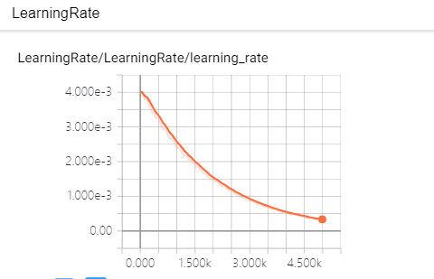
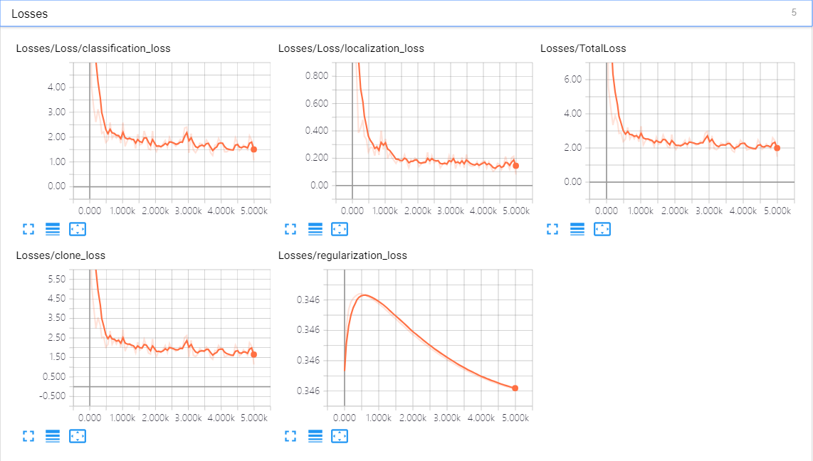
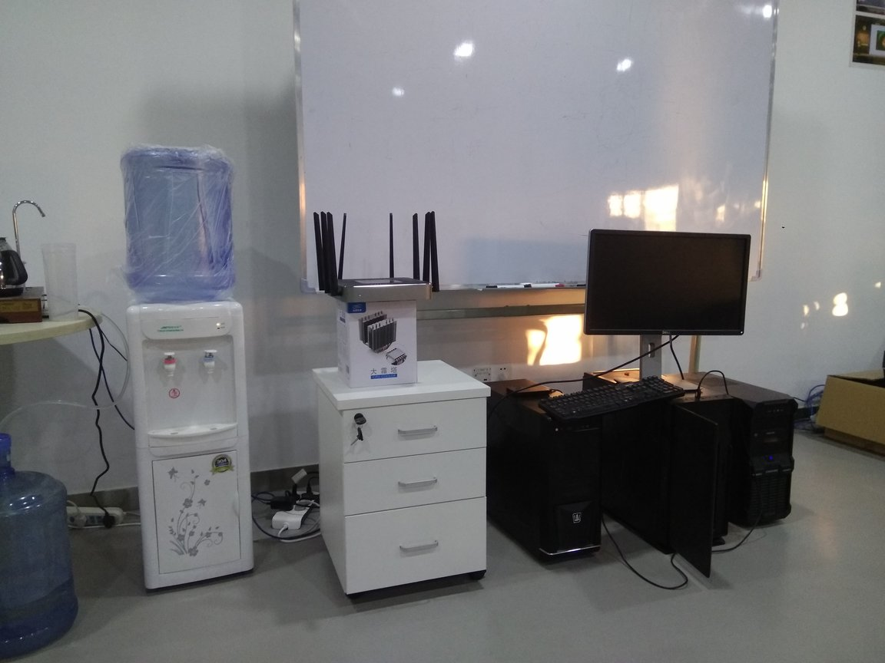
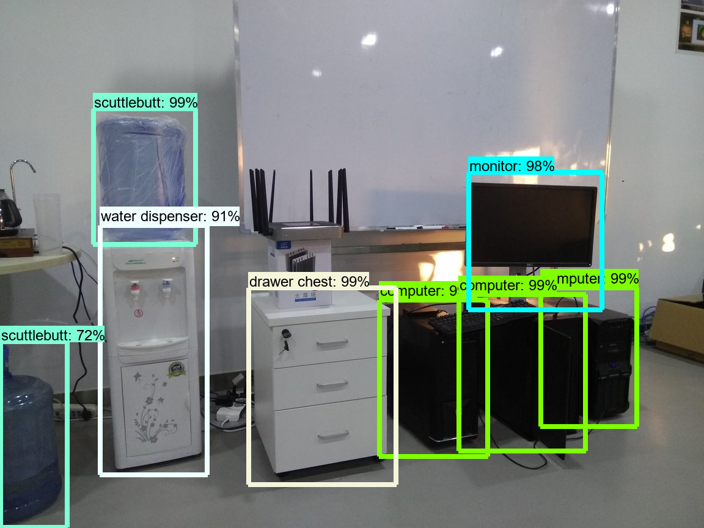

# 利用[tensorflow models](https://github.com/tensorflow/models)的[object detecion](https://github.com/tensorflow/models/tree/master/research/object_detection)训练自己的数据集

>本仓库仅包含models中修改的文件、添加的文件以及训练的生成的graph

## 关于SSD模型框架代码解析参见我的[csdn博客](https://blog.csdn.net/AECHO1/article/details/81196498)

## 具体实现流程：
- [安装](#installation)
- [数据处理](#dataprocess)
- [训练](#trainingprocess)
- [测试](#validationprocess)

<br/>

# <span id="installation">1.安装</span>
主要流程依然是参考tensorflow/models/object detection的[文档](https://github.com/tensorflow/models/blob/master/research/object_detection/g3doc/installation.md)

我使用的环境是window 10 + ananconda，由于windows不支持*操作符，编写了[proto2py.py](./models/research/proto2py.py)的脚本:  
```python
import os

init_path = os.getcwd()
path = 'object_detection\pycocotools\'
proto_path = os.path.join(init_path,path)
f_list = os.listdir(proto_path)

for f in f_list:
    if '.proto' in f:
        print('process:' + f)
        cmd_line = 'protoc ' + os.path.join(path, f) + ' --python_out=.'
        #print(cmd_line)
        os.system(cmd_line)
        
print('process done!')
```
<br/>

# <span id="dataprocess">2.数据处理</span>
下面所有操作见代码：[select_and_split.py](./models/research/data/QuizDevkit/select_and_split.py)

## 2.1 数据筛选
考虑到拍摄的照片可能会有模糊的，先处理掉模糊的照片。  
由于拍摄的照片的场景和照片的size都是一样的，这里常用用传统的图像高通滤波取图像的高频值，通过统计高频值来剔除模糊的照片。

### 高通滤波代码操作：
```python
# 7x7的高通滤波
flt = [-0.001953, -0.015625, -0.044922, -0.060547, -0.044922, -0.015625, -0.001953,
        -0.015625,  -0.080078, -0.128906, -0.128906, -0.128906, -0.080078, -0.015625,
        -0.044922,  -0.128906,  0.091797,  0.349609, 0.091797,  -0.128906, -0.044922,
        -0.060547,  -0.128906,  0.349609,  0.835938, 0.349609,  -0.128906, -0.060547,
        -0.044922,  -0.128906,  0.091797,  0.349609, 0.091797,  -0.128906, -0.044922,
        -0.015625,  -0.080078, -0.128906, -0.128906, -0.128906, -0.080078, -0.015625,
        -0.001953, -0.015625, -0.044922, -0.060547, -0.044922, -0.015625, -0.001953,
        ]
flt = np.reshape(flt,(7,7))
print(flt)

lst = []
dict_lst = {}
img_list = os.listdir(img_dir)

for f in img_list:
    if '.jpg' in f:
        
        img = cv2.imread(os.path.join(img_dir,f),cv2.IMREAD_COLOR)

        edges = np.abs(cv2.filter2D(img,-1,flt))
        shapness = np.sum(edges)
        lst.append(shapness)
        dict_lst[shapness] = f
        print('process:',f,'shapness:',shapness)

sort_idx = np.argsort(lst)
```
>__从验证结果来看，这种方式不太可靠，使用上面删去锐度值最小的10张照片，其余的使用人工辅助的方式删除__  

### 删除模糊照片
```python
# 删除锐度值最小的10张图片，验证下来这种方法不可靠，最终选择删除10张图片
for i in range(10):
    shutil.move(os.path.join(img_dir,dict_lst[lst[sort_idx[i]]]),rb_dir_img)
    shutil.move(os.path.join(xml_dir,dict_lst[lst[sort_idx[i]]].split('.')[0] + '.xml'),rb_dir_xml)

# 人工辅助删除剩下不清晰的图片
list_manual = [34,35,41,51,52,54,62,65,66,72,73,75,81,90,96,98,123,129,131,134,135,138,152]
print(len(list_manual))
for idx in list_manual:
    shutil.move(os.path.join(img_dir,str(idx).zfill(4) + '.jpg'),rb_dir_img)
    shutil.move(os.path.join(xml_dir,str(idx).zfill(4) + '.xml'),rb_dir_xml)
```
### 一共删除了33张模糊的照片

## 2.2 生成每个分类的train和val的列表

### 先统计没个分类的数目，尽量使每个分类在测试机和训练集的比例相对均衡

**统计值如下:**
```
{'computer': 120, 'monitor': 115, 'scuttlebutt': 121, 'water dispenser': 119, 'drawer chest': 120}
```
>__从统计值来看，几乎每张照片中都包含了所有分类物品__。从所有数据中随机分配20张作为验证集，剩下数据作为训练集
```python
list_all = list(range(122))
#随机选取20张图片作为验证集
list_val = random.sample(list_all, 20)
```


生成的train和val的列表文件见[./models/research/data/QuizDevkit/split](./models/research/data/QuizDevkit/split)

## 2.3 生成tfrecord文件
生成脚本[create_quiz_tf_record.py](./models/research/object_detection/dataset_tools/create_quiz_tf_record.py)  

生成的tfrecord[文件](./models/research/data/)：
```
quiz_train.record
quiz_val.record
```
<br/>

# <span id="trainingprocess">3.训练</span>

## 3.1 修改配置文件[ssd_mobilenet_v1_quiz.config](./models/research/models/ssd_mobilenet_v1_quiz.config)
训练部分主要修改了batch_size,steps,learning_rate等相关参数
```config
train_config: {
  batch_size: 12
  optimizer {
    rms_prop_optimizer: {
      learning_rate: {
        exponential_decay_learning_rate {
          initial_learning_rate: 0.004
          decay_steps: 100
          decay_factor: 0.95
        }
      }
      momentum_optimizer_value: 0.9
      decay: 0.9
      epsilon: 1.0
    }
  }
  fine_tune_checkpoint: "D:\\Documents\\AI\\ThirdParty\\models\\research\data\\pre_trained\\ssd_mobilenet_v1_coco_2017_11_17\\model.ckpt"
  from_detection_checkpoint: true
  # Note: The below line limits the training process to 200K steps, which we
  # empirically found to be sufficient enough to train the pets dataset. This
  # effectively bypasses the learning rate schedule (the learning rate will
  # never decay). Remove the below line to train indefinitely.
  num_steps: 5000
  data_augmentation_options {
    random_horizontal_flip {
    }
  }
  data_augmentation_options {
    ssd_random_crop {
    }
  }
}
```

## 3.2 训练中其他错误
tf1.7与python3.6部分语法上的兼容性问题，执行train.py的时候报错，修改了[learning_schedules.py](./models/research/object_detection/utils/learning_schedules.py)  
```python
  rate_index = tf.reduce_max(tf.where(tf.greater_equal(global_step,boundaries),
                                      list(range(num_boundaries)),
                                      [0] * num_boundaries))
```
>range(num_boundaries)  
>__改为:__  
>list(range(num_boundaries))

## 3.3 训练结果
>学习率  


>训练误差  


**从上图来看，在2000个step以后就基本上loss就基本上不怎么下降了**

<br/>
 
# <span id="validationprocess">4.测试</span>
验证集中选0002.jpg执行一次inference.py的结果如下  
>原图：  


>Inference结果图：  



</br>

# 其他
1.mobilenet是针对移动端上使用的一个小的网络模型，大幅减小了运算量的同时并没有带来太多性能的损失。其核心在于将一次卷积分为Deepwise卷积和Pointwise的卷积两步，deep widht的卷积实际上是在每个channel上做一个3x3(mobilenet基本上都是由3x3小卷积构成)的卷积，Pointwise卷积就算1x1的卷积，这种方式可以将传统的卷积(3x3)的运算量减小到原来的1/8到1/9之间。  
